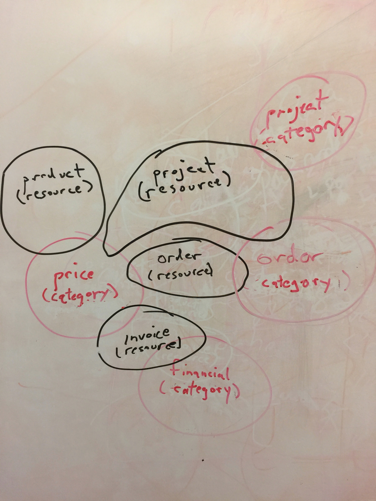
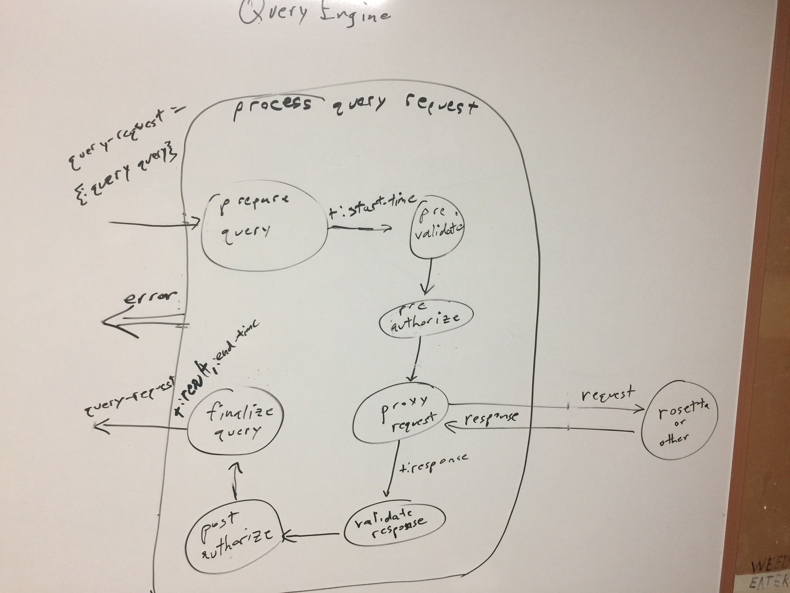
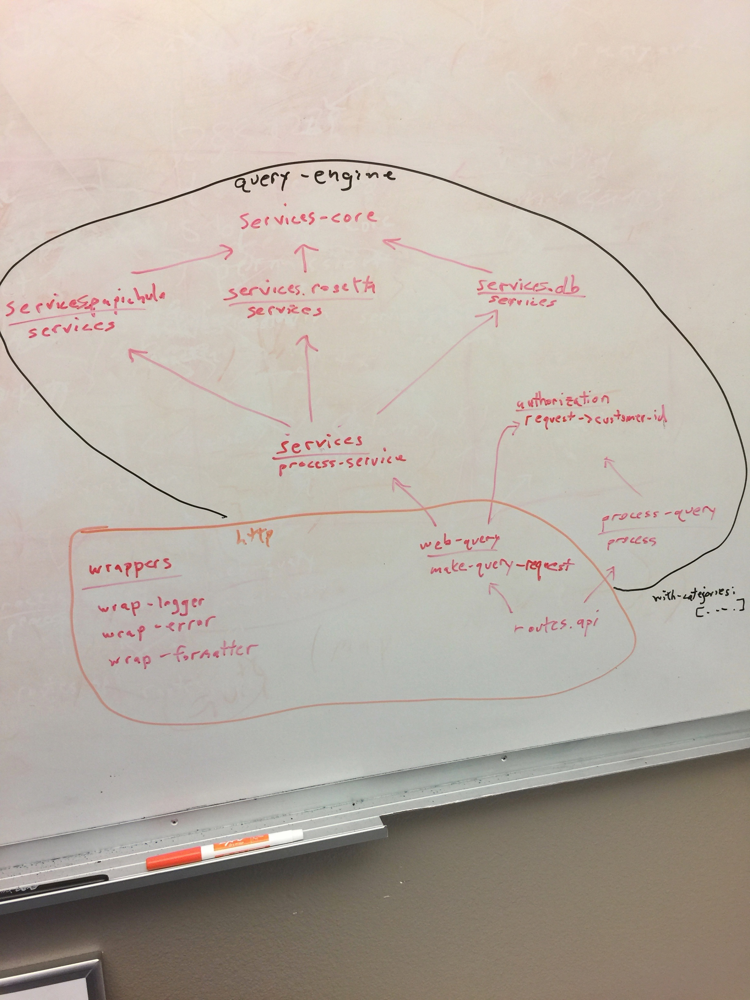

# rampart

generated using Luminus version "2.9.10.97"
lein new luminus +auth +mysql +cljs

## Prerequisites

You will need [Leiningen][1] 2.0 or above installed.

[1]: https://github.com/technomancy/leiningen

## Running

To start a web server for the application, run:

    lein run
    
## Description

Framework to provide authentication/authorization to backend services.

Note: this project is functional and being used in production, but portions will become more generalized and features added as time allows. Some of the incomplete portions are described below with the future tense, as in, "will be".

## Resource vs. data category


Rampart serves resources provided by proxy services. Security is not a proxy service's concern -- that is rampart's concern. But how does it achieve this?

It provides a data category overlay to the resources. For example, an order resource may have both an order data-category and a price data-category. In this way, a customer may be allowed to view orders (data category of order: [:view]) but prevented from viewing pricing (customer doesn't have price data category). In this case, the proxy server may ship the order with prices, and it will be rampart's responsibility to strip just the pricing info. It will do this via a schema of every field that may be returned by a query, and each field will define its data category (or will be nil, in which case it is in the parent's data category).

## Process description

The central component is the system is this function:

```clojure
(defn process [query-request]
  (->>
   query-request
   prepare-query
   pre-validate
   pre-authorize
   process-request
   post-validate
   post-authorize
   finalize-query
   ))
```
   
The query-request parameter is a map which is returned from each function, and in
turn passed to the next function. Each step of the thread may add elements to the map. For example, prepare-query adds the :start-time.

Query-request has one required key, the :query,
which is also a map, containing :subsystem, :query-name,
and :params keys.

The subsystem is a psuedo self-contained system that can operate independently.
Each subsystem will typically be instantiated in a service, but several subsystems
can be contained in a monolithic program.

Rampart itself is an example of a subsystem, as it owns the data used for it's
business rules. There are of course links from the customer-ids and account-numbers
in rampart to the full objects in another system, but rampart itself does not
access this other data.

The query-name refers to the query that is to be run on the backend server.
A definition of the query is associated with this query name.

Finally the params are parameters to be passed to the remote query.

Pre-authorize typically authorizes the :query values, while post-authorize
typically authorizes the body of response from the backend server.



## Namespaces


The code is organized in namespaces. Though not part of the namespace name, this chart shows which belong to the responsibility of the query engine vs which to the http concern.

The securities namespace will read the services provided by the proxied services into one map, which will be used for routing an incoming request to the appropriate service. Process-query contains the query engine as outlined above.

Authorization provides translation from a webtoken into a customer id, as well as authorization of a query.

Web query is responsible for finding the appropriate proxy server and customer id, and for building a query-request map. Note that while the query-engine only requires the query-request to contain the :query, web-query also adds the http :request, as it may be needed for properly formatting the map returned by the query-engine.

Routes.api defines the allowable routes, generates the query-request, and processes the request.

**Middleware:** Wrap-logger logs the requests. Wrap-error captures errors thrown by the query-engine to produce the proper http response. And wrap-formatter will be responsible for converting the proxy response into the web browser's desired format. (Currently adds the original :query to the response for debugging purposes.)


## License

Copyright © 2016 FIXME
